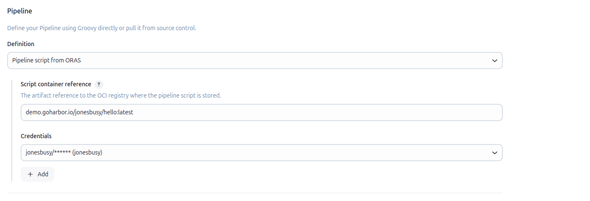
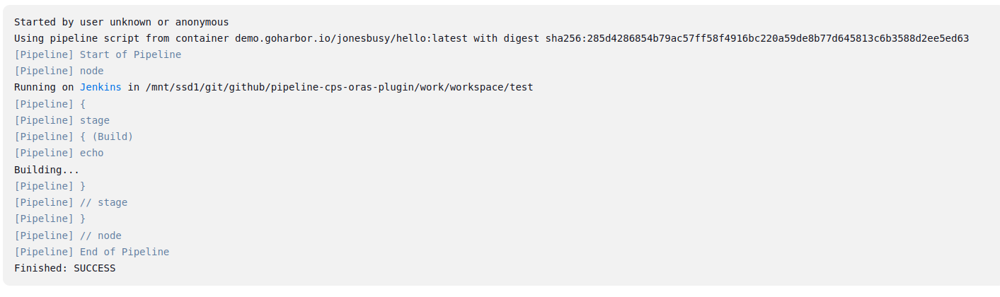

# Pipeline CPS ORAS Plugin

[](https://ci.jenkins.io/job/plugins/job/pipeline-cps-oras-plugin/)
[](https://plugins.jenkins.io/pipeline-cps-oras/)
[](https://github.com/jenkinsci/pipeline-cps-oras-plugin/releases/latest)
[](https://github.com/jenkinsci/pipeline-cps-oras-plugin/graphs/contributors)

## Introduction

This plugin allow to fetch pipeline scripts (CPS) stored into a OCI compliant registry (ORAS).

> [!WARNING]
> The ORAS Java SDK is currently in **alpha** state and might impact the stability of this plugin.
>
> It's configuration and APIs might change in future releases

<p align="left">
<a href="https://oras.land/"></a>
</p>


## Getting started

When configuring a pipeline job, just select the "Pipeline script from ORAS" option in the "Definition" section.

Credentials are optional if using an unsecured registry, otherwise you need to provide a username/password credential.



In order to consume a pipeline script artifact it need to have the following media type: `application/vnd.jenkins.pipeline.manifest.v1+json`

You can push such an artifact using the [ORAS CLI](https://oras.land/docs/commands/oras_push):

```bash
oras push localhost:5000/hello:latest --artifact-type application/vnd.jenkins.pipeline.manifest.v1+json Jenkinsfile
```

You will see then on the logs the digest of the pipeline script artifact



## LICENSE

Licensed under MIT, see [LICENSE](LICENSE.md)

